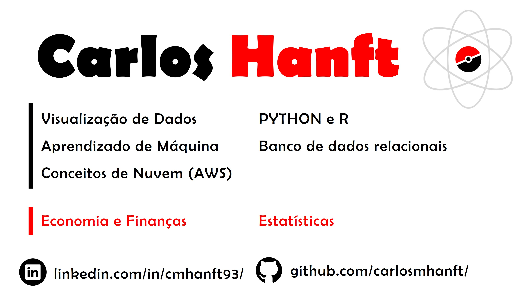

### Fala pessoal, tudo certo ?

Meu nome é Carlos e estou dedicando meu tempo para aprender ciência de dados e tecnologias de Big Data.

Aos poucos vou incluindo projetos no meu portfólio e se puder contribuir com ideias/críticas para quem está no início terá meu imenso agradecimento.

Sou formado em Economia na FEA-USP e trabalhei no mercado financeiro em áreas de operações, negócios e conciliação de carteiras até decidir mudar de carreira e começar meus estudos na pós graduação em Big Data e focar meu tempo em aprender os fundamentos para me tornar um Cientista de Dados.

# Gosto muito de:

- Python
- Power BI
- Spark (Pyspark / SparkSQL)
- BD relacionais: SQL Server

# Estou estudando:

- Docker
- Dremio

# Fun fact:

Sou vegetariano ! Bora salvar este mundo.

 

<table>
    <tr>
        <td class="first"></td>
        <td class="second"></td>
    </tr>   
</table>

